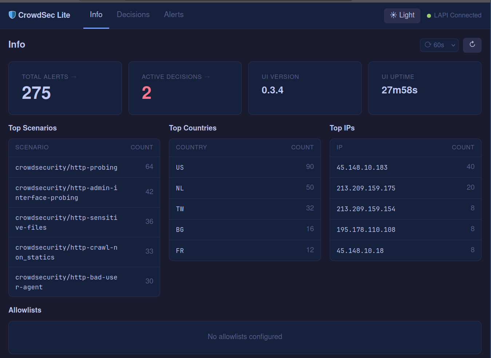
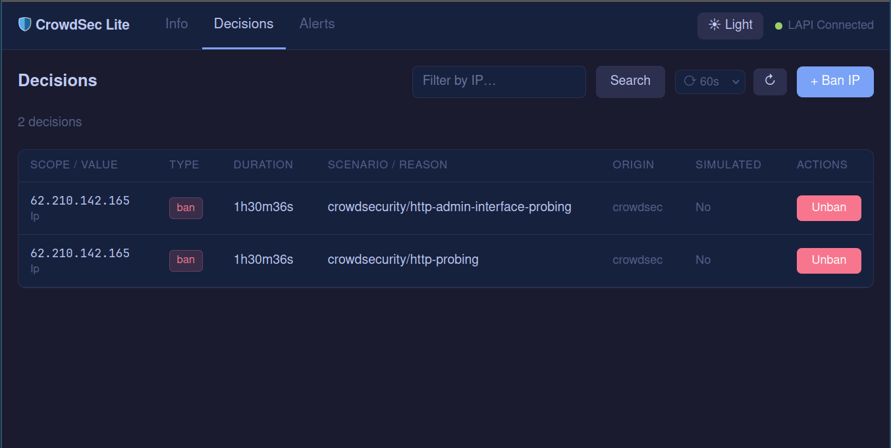
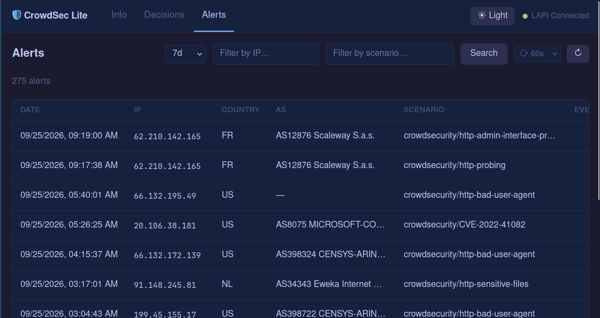

# CrowdSec Lite UI

Minimal self-hosted dashboard for [CrowdSec](https://crowdsec.net).

**What it does:** view alerts · view active bans · ban/unban IPs

**What it doesn't:** no local database · no background sync · no caching · no extra dependencies

| Docker image | RAM idle | RAM active |
|---|---|---|
| ~8 MB | ~15 MB | ~30 MB |

Built with Go (stdlib only) + React. Single static binary with embedded frontend.

## Features

- **Info** — stats overview: total alerts, active bans, top scenarios/countries/IPs
- **Decisions** — active bans table with one-click unban
- **Alerts** — alert history with filters (IP, scenario, time range) and inline details
- Dark (Tokyo Night) and light (Nord) themes, auto-refresh, persisted preferences

## Quick start

See [INSTALL.md](INSTALL.md).

## Configuration

| Variable | Required | Default | Description |
|---|---|---|---|
| `LAPI_URL` | ✅ | — | CrowdSec LAPI base URL |
| `LAPI_USERNAME` | ✅ | — | Watcher machine ID |
| `LAPI_PASSWORD` | ✅ | — | Watcher machine password |
| `LISTEN_ADDR` | | `:3000` | Listen address |
| `LAPI_SKIP_TLS_VERIFY` | | `false` | Skip TLS cert verification |
| `ALERTS_SINCE` | | `168h` | Default alerts lookback window |

## Examples

